% Computers
% Silvestro Di Pietro
% 15/03/2023

# Definition

##
A computer is a machine that can be programmed to carry out sequences of arithmetic or logical operations (computation) automatically.

. . .

> Computer is a machine designed to solve problems automatically

# Little story

## Little story

> Antikythera mechanism (87 BC)

. . .

The oldest known example of an analogue computer
 used to predict astronomical positions and eclipses decades in advance. 
 
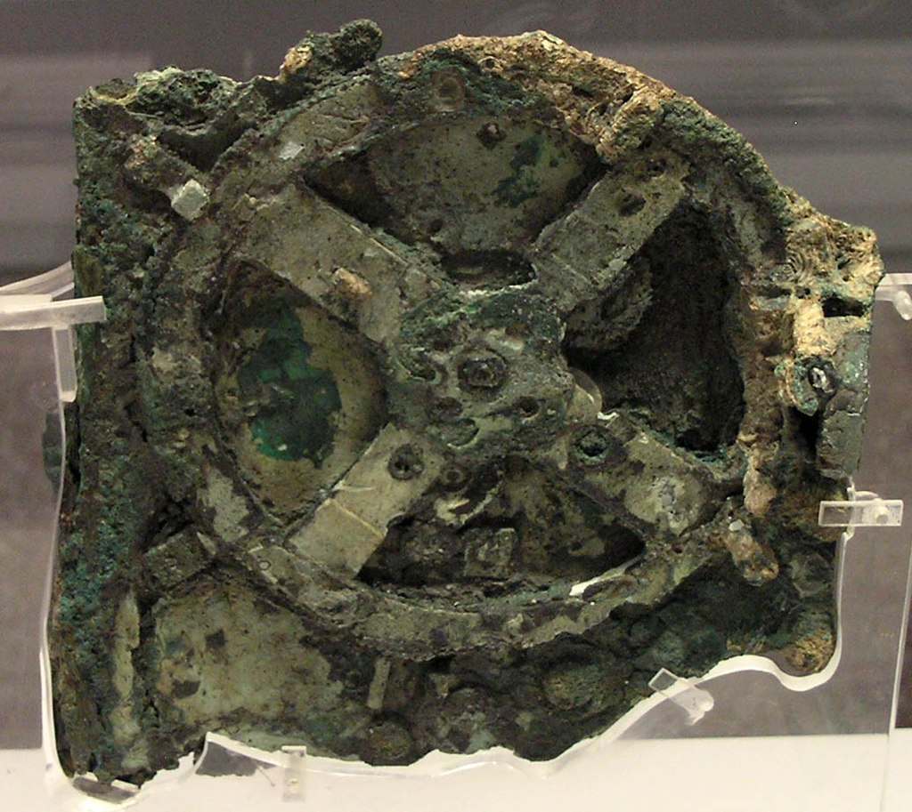{width=200}

----

## Little story

> Jacquard machine (1804)

. . .

Simplifies the process of manufacturing complex textiles he machine.
 Was controlled by a  chain of punched cards;

{width=200}

----

## Little story

> The differential engine (1820)

. . .

A mechanical calculator designed to tabulate polynomial functions. Was first created by Charles Babbage and is considered the first moder computer.

{width=200}

# Analog and Digital

## Analog computers

. . .

Is a type of computer that uses the **continuous** variation aspect ``(analog signals)`` to model the problem being solved.

{width=200}

----

### Example of analog computer

Here is tide predictor machine that, using a sequence of pulley, can predict ``(compute)``  tides.
This is conceptually similar to the Antikythera mechanism.

{width=300}

----

## Digital computers

. . .

Is a type of computer that uses the discrete form ``(discrete inputs)`` to model the problem being solved.

{width=300}

----

### Example of Digital computer

The Lehmer sieve in 1926 was made using chains of varying length, with rods at appropriate points in the chains. As the chains turned, the rods would close electrical switches, and when all the switches were closed simultaneously a solution had been found

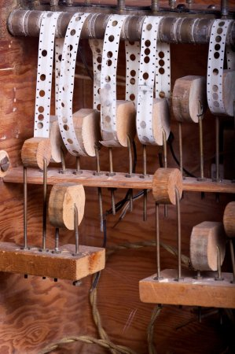{width=200}

# The computer science

## Hilbert Problems(1900)

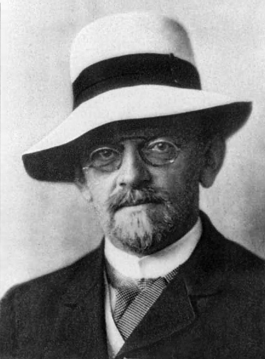{width=200}

Among the 23 problems stated by Hilbert we summarize them in three questions and those were not just questions in mathematics; they were questions about mathematics itself 

____

## Completeness of Math

. . .

1. **Is mathematics complete**? That is, can every mathematical statement be proved or disproved from a given finite set of axioms?

. . .

2. **Is mathematics consistent**? In other words, can only the true statements be proved?

. . .

3. **Is every statement in mathematics decidable**? There is a **definite procedure** that can be applied to every statement that will tell us in finite time if the statement is true or false?

____

## Kurt Gödel

Kurt Gödel in 1930 answered to the first two stating shortly that 
if the answer to question 2 above is “yes” (i.e., mathematics is consistent), then the answer to question 1 (is mathematics complete?) has to be “no.”

{width=200}

____

## Entscheidungsproblem

The last question is known by its German name as the Entscheidungsproblem (“decision problem”), and goes back to the seventeenth-century mathematician **Gottfried Leibniz. Leibniz** actually built his own calculating machine, and believed that humans could eventually build a machine that could determine the truth or falsity of any mathematical statement.

----

## Alan Turing
{width=150}

The decision problem was answered by Alan Turing in 1935 and the answer was no, (the halting problem) but doing this he create the computer concept as we know it today.

. . .

_Alan turing did this when he was twenty-three-year-old as graduated student under the logician Max Newman_

----

## Leibniz Legacy
Following the intuition of Leibniz of more than two centuries earlier, Turing formulated his definition by thinking about a powerful calculating machine that could not only perform arithmetic but also could `manipulate symbols` in order to prove mathematical statements.

----

## Thought Machine
By thinking about how humans might calculate, he constructed a **mental design** of such a machine

. . .

> ``The Turing machine turned out to be a blueprint for the invention of the electronic programmable computer.``

----

## Turing Machine

{width=600}

. . .

is composed by a `tape`  where an  `head` can scroll in any direction and can read/write symbols on it. The `head` can use a finite control made up with **rules** eg: if `tape cell` read is (x) then move to next `tape cell` and write (y)  ...

----

## Limits!

. . .

1. This thought machine has set the definition of ***definite procedure,*** fixing an ill-defined notion,

. . .

2. Has blueprinted and paved the way to modern computers

. . .

3. Has given bird to the *computer science*, exploiting the _halting problem_ and demonstrating that ``there are limits to what can be computed``.

----

## von Neumann

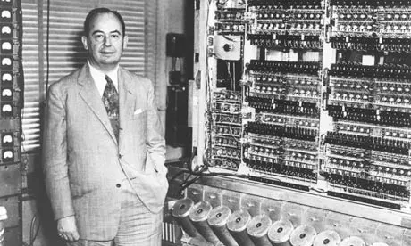{width=300}

The **von Neumann architecture** consists of a `random access memory` (RAM) that stores both program instructions and data, and a central `processing unit` (CPU) that fetches instructions and data from memory and executes the instructions.

# Cellular Automaton

## A forward step
{width=100}

von Newman working in Los Alamos with Stanislaw Ulam start thinking about a different architecture of computer mainly to solve fluid motions problems

----

## Definition

A cellular automaton consists of a regular grid of cells, each in one of a finite number of states, such as on and off.
 An initial state `(time t = 0)` is selected by assigning a state for each cell. A new generation is created `(t = t+1)`, according to some **rules** that determines the new **state** of each cell in terms of the current state of the cell and the states of the cells in its neighborhood on grid.

----

## cellular grids

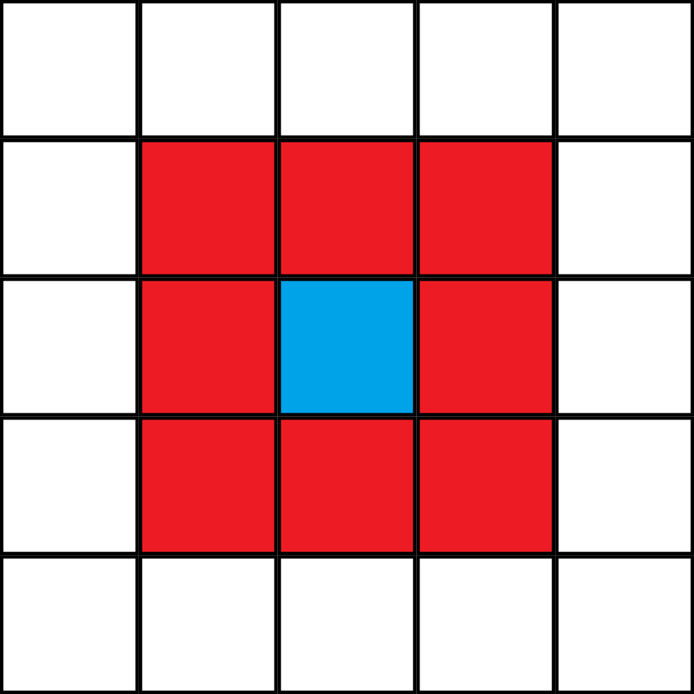{width=200}

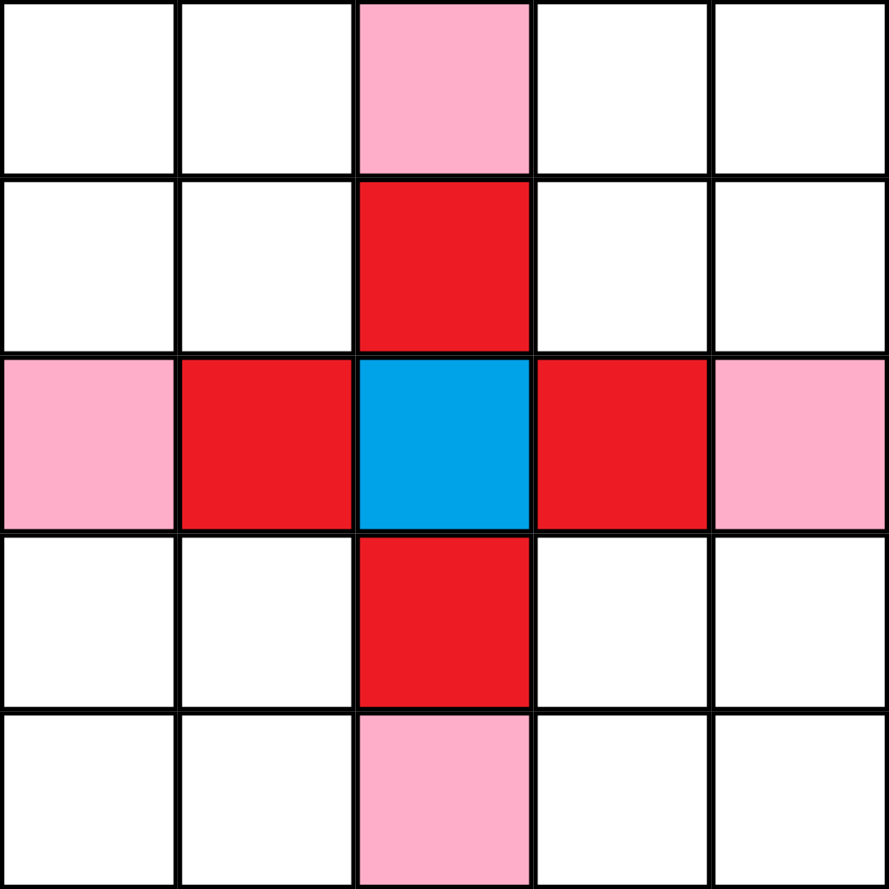{width=200}

----

## Conway's Game of Life

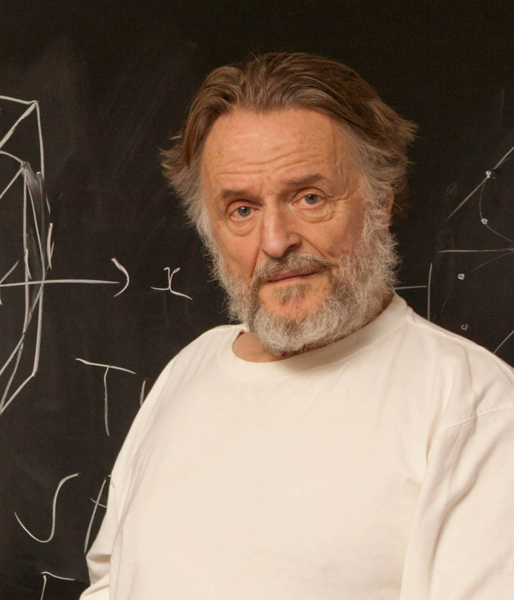{width=150}

1. Any live cell with two or three live neighbours survives.
2. Any dead cell with three live neighbours becomes a live cell.
3. All other live cells die in the next generation. Similarly, all other dead cells stay dead.

----

## Guns and Glider

{width=250}

{width=1800}

----

## Wolfram Automaton

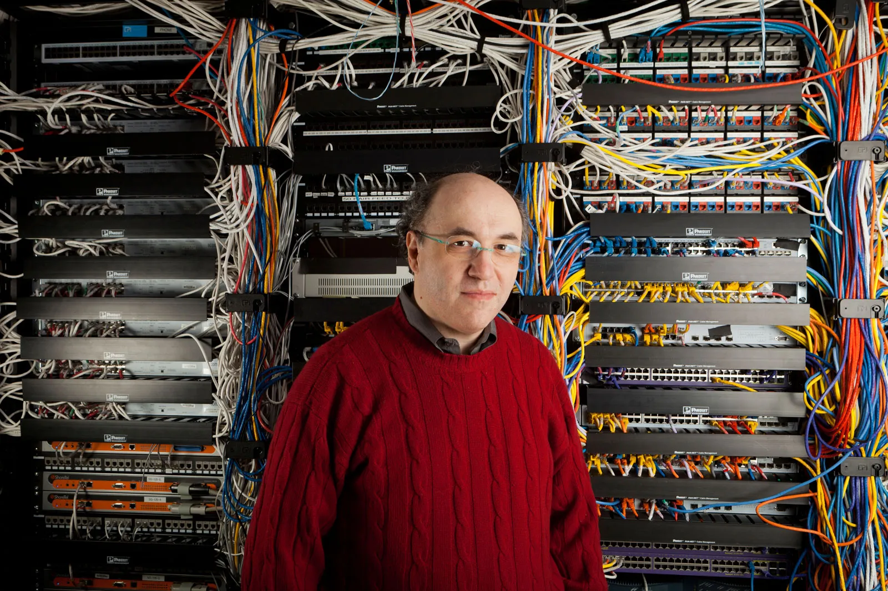{width=250}

Steven Wolfram simplified the concept of cellular automata using just 8 bits to create 256 possibile rules, and discover this:

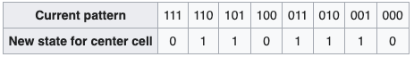{width=450}

----

## Rule 110

{width=750}

----

## Automaton 256 rules

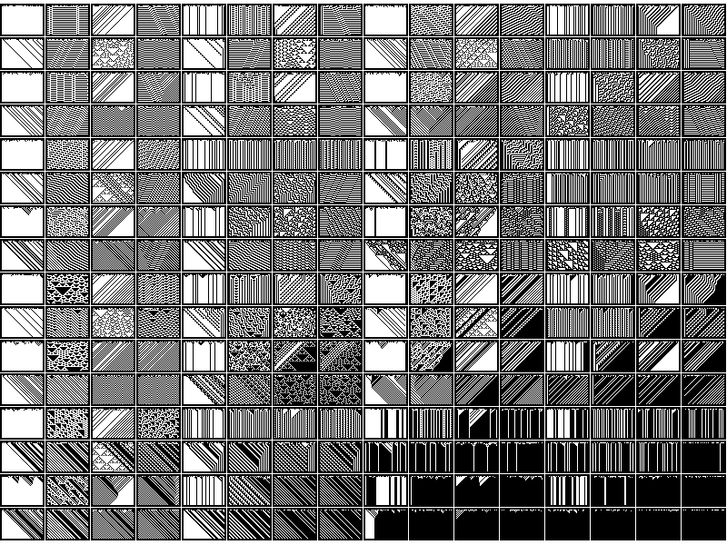{width=650}

----

## Universal computer

A universal computer in a cellular automaton is a system that can compute anything that a Turing machine can compute (another term for this is Turing-complete). A cellular automaton in which such a system exists is called universal. A universal computer may be either infinite or finite, but when combined with a universal constructor, it is assumed to be finite.

----

## Chaos and Order

`Rule 110` was proved to be an **Universal Computer**  but `Rule 30` seem to be hitting the edge from Chaos and Order in the field of complexity, leading to an idea of 

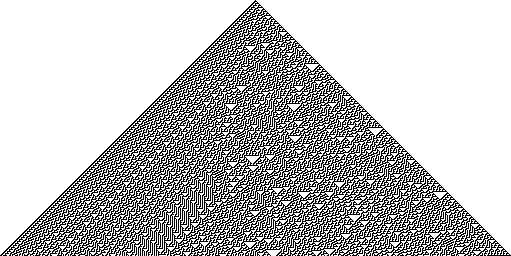{width=650}

----

## Complexity

{width=650}

## New Kind Of Science

1. The proper way to think about processes in nature is that they are computing.
2. Since even very simple rules can support universal computation, the ability to support universal computation is very common in nature.

----

## New Kind Of Science
3. Universal computation is an upper limit on the complexity of computations in nature. That is, no natural system or process can produce behavior that is “noncomputable.”
4. The computations done by different processes in nature are almost always equivalent in sophistication.

# Conclusion

----

{width=500}

----

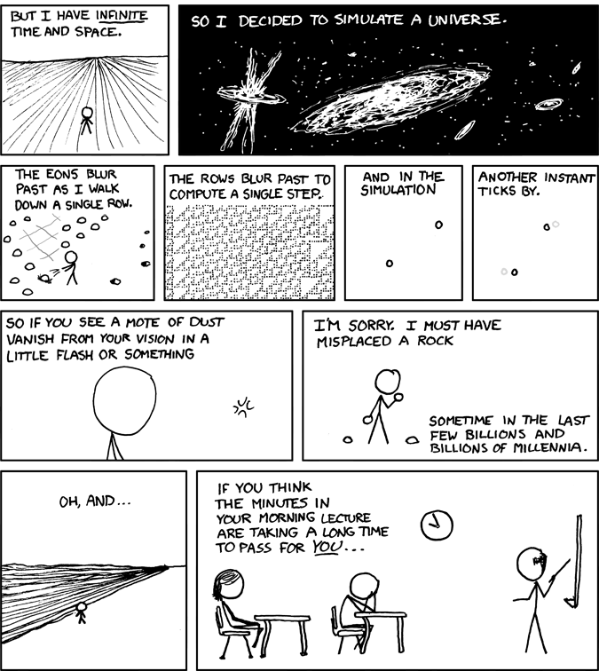{width=550}

