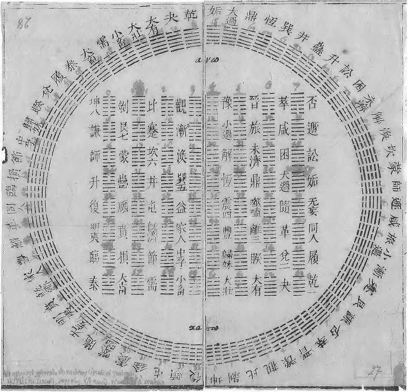
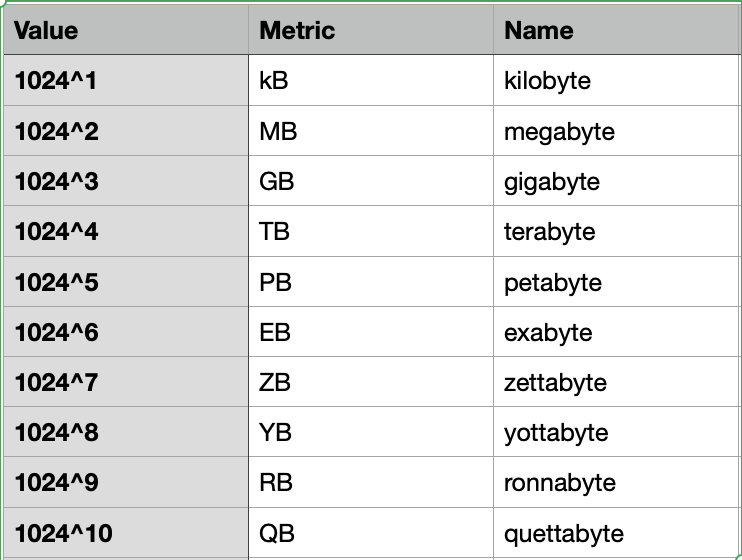
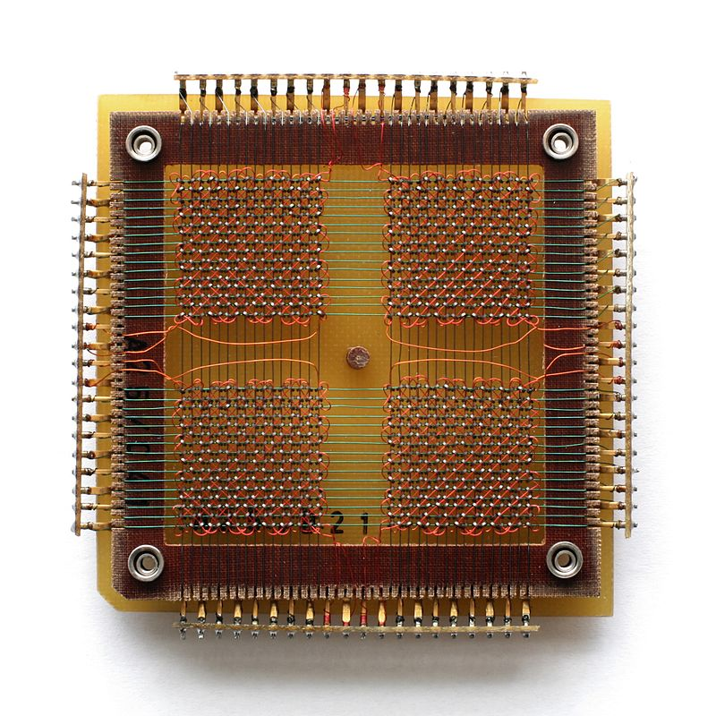
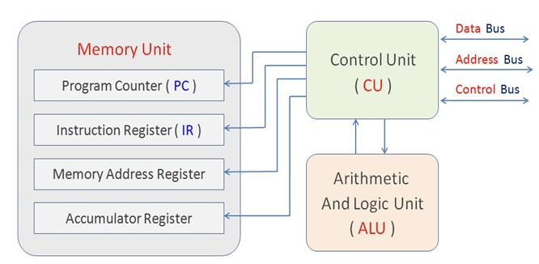

% What is information
% Silvestro Di Pietro
% 16/03/2023

# Definition

## Information

Any process that is not completely random, and any observable pattern in any medium can be said to convey some amount of information.

# Some Science

## Shannon
{width=100}

For Claude Shannon (1948) the information consists

1. the data ``what``
2. the channel ``how``
3. the receiver ``who``

----

## The Surprise

The main idea about the Information theory is the "information value" that depends from the novelty or how much the data is surprising. Shannon introduce the `entropy` (as is in thermodinamics) formulating the theory. 

----

## Enalotto

{width=300}

Data on the first sequence has very little meaning, but the value of the second sequence?

- just numbers **58 45 22 51 57 78**
- winning numbers **23 42 46 54 58 79**

*Concorso Nº30 del 11 March 2023*

----

## A little demon (1867)

{width=300}

Maxwell elaborate this thought experiment in order to confutate his 2nd thermodynamics law trying to avoid entropy with a `demon`.

----

## Thermo information

{width=200}

62 year later **Leo Szilard** stated that acquiring information require energy increasing entropy, **Léon Brillouin** stated that the energy of this action is needed when the demon erase the information.

----

## Quantum wave

{width=600}

Acquiring the information cause the collapsing of the wave function.

## Information need energy

- the information process generate entropy and need energy
- the information is a physical fact.

# Binary numbers

## Minimal Information

{width=200}

Chings suggested to Gottfried Wilhelm Leibniz the numeration in base 2.

| ching symbol |      Value      |
|:------------:|:---------------:|
|   -  -       |                0|
|   ---        |                1|

----

## Base 2

{width=200}

. . .

Binary is the minimal way to code information, and for this reason are widely used symbols in informatics.

`https://www.leibniz-translations.com/binary.htm` 

----

## Aritmetic

{width=400}

. . .

Binary numbers are just numbers

## Base 2 exponential
1 kb =2^10
{width=400}

# storage

## R A M

{width=300}

. . .

Random Access Memory,
Usually we consider this *volatile memory* that need energy to keep the information stored

----

## R O M

{width=300}

. . .

Read Only Memory: is a memory that can just be read and will store permanently the information without need of energy

----

## LOL ROM

{width=300}

Software written by MIT programmers was woven bit by bit into core rope memory by female workers in factories. Some programmers nicknamed the finished product LOL memory, for Little Old Lady memory.

----

## Hard Drive

{width=300}

A magnetic disk partitioned with sectors and block of data with a movable head reading and writing capable.

## Flash Memory

{width=300}

Flash memory is an electronic non-volatile computer memory storage medium that can be electrically erased and reprogrammed: is fast and cheap (in your phone the ram is this kind of memory)

----

## Memory hiearchy

{width=700}

# A Computer

## CPU

{width=700}

----

## ComputerSchema

{width=700}
