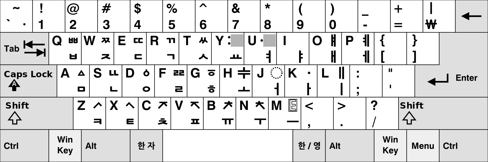
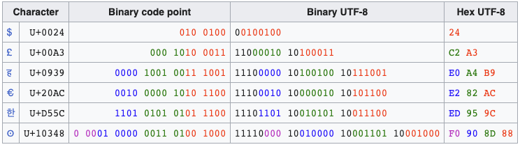

% Encoding 
% Silvestro Di Pietro
% 20/03/2023

# Definition

## Encoding
In computers, encoding is the process of putting a sequence of characters (letters, numbers, punctuation, and certain symbols) into a specialized format for efficient transmission or storage. Decoding is the opposite process -- the conversion of an encoded format back into the original sequence of characters.


# Charsets

## Charsets Definition
{width=300}

* A character is a minimal unit of text that has semantic value.
* A character set is a collection of characters that might be used by multiple languages.
* A coded character set is a character set in which each character corresponds to a unique number.

----

## Morse Code
{width=300}

----

## Chars Encoding

{width=300}

----

## Code Unit

A code unit is the "word size" of the character encoding scheme, such as '7-bit', '8-bit', '16-bit'. 
In some schemes, some characters are encoded using multiple code units, resulting in a variable-length encoding. A code unit is referred to as a code value in some documents

----

## Code Unit Examples

* A code unit in `US-ASCII` consists of ***7 bits**;
* A code unit in `UTF-8`, EBCDIC and GB 18030 consists of **8 bits**;
* A code unit in `UTF-16` consists of **16 bits**;
* A code unit in `UTF-32` consists of **32 bits**.


# Ascii

## what is

abbreviated from `American Standard Code for Information Interchange`, is a character encoding standard for electronic communication. ASCII codes represent text in computers, telecommunications equipment, and other devices. Because of technical limitations of computer systems at the time it was invented, ASCII has just `128 code points`, of which only 95 are printable characters.

----

## ASCII table

{width=800}


# UTF-8

## what is

UTF-8 is a variable-length character encoding standard used for electronic communication. Defined by the Unicode Standard, the name is derived from Unicode (or Universal Coded Character Set) Transformation Format – 8-bit.

----

## UTF8 

UTF-8 is capable of encoding all `1,112,064`  valid character code points in Unicode using one to `four one-byte (8-bit)`  code units. 
Code points with lower numerical values, which tend to occur more frequently, are encoded using fewer bytes. It was designed for backward compatibility with `ASCII`: 
the first 128 characters of Unicode, which correspond one-to-one with ASCII, are encoded using a single byte with the same binary value as ASCII, so that valid ASCII text is valid UTF-8-encoded Unicode as well.

----

## Conversion: ICONV

The iconv program converts text from one encoding to another encoding.  More precisely, it converts from the  encoding given for the -f option to the encoding given for the -t option. Either of these encodings defaults    to the encoding of the current locale. All the inputfiles are read and converted in turn; if no inputfile is    given, the standard input is used. The converted text is printed to standard output.

----

## ICONV example

> man iconv

```bash
cat exampleISO8859.txt | iconv -f ISO-8859  -t UTF-8 > exampleUTF8 
```

----

## UTF8 Example

{width=800}

## HTML usage

```HTML
 <!DOCTYPE html>
<html>
	<head>
		<meta charset="utf-8">
	</head>
</html>
```
  
# BASE64

## What is

In computer programming, Base64 is a group of binary-to-text encoding schemes that represent **binary data** (more specifically, a sequence of `8-bit` bytes) in sequences of `24 bits` that can be represented by four `6-bit` Base64 digits.

## Usage

Binary files cannot be transmitted or stored easily because in a binary file there are bytes, or better, sequence of bits that will interfere within the transmit protocol o the data storage format (eg a binary file sent by email.) or database storage

----

## how encode/decode

. . .

>shell time!

In Unix you can b64 encode a binary file using the shell command `base64`

```BASH
cat images/LogoIfom.png | base64 > images/LogoIfom.b64

cat images/logoIfom.b64 | base64 -d > decoded.png
```

----

## b64 overhead

|File name|Size|Base64 size|Base64 gzip size|
---------|----|-----------|----------------|
|ifomLogo.png|5754|10233|5533|

## b64 ENCODING


{width=700}


# URL encoding

## Uniform Resource Identifier

>RFC rfc3986

URL is a subset of th URI and is for Uniform Resource Identifier.
in URL there are some reserved characters as `forward slash` 

> !	#	$	&	'	(	)	*	+	,	/	:	;	=	?	@	[	]

----

## Percent escaping

You can represent binary chars escaping (prefixing) them using a %

> **A** (see ASCII table) can be represented by `%41`