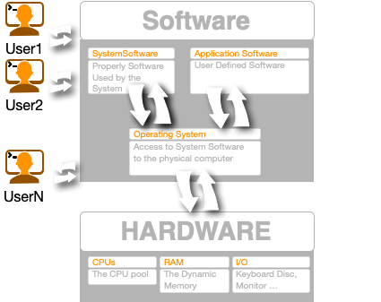

% Operative System 
% Silvestro Di Pietro
% 21/03/2023

# Definition

## Wikipedia Definition
An operating system (OS) is system software that manages computer hardware, software resources, and provides common services for computer programs.

----

## OS

{width=700}

----

## Functions

* Memory Management
* Processor Management
* Device Management
* File Management
* Network Management
* User Management

# Memory Management

## Main Memory
Main memory provides a fast storage that can be accessed directly by the CPU. For a program to be executed, it must in the main memory. An Operating System does the following activities for memory management

----

## Tasks

* Keeps tracks of primary memory, i.e., what part of it are in use by whom, what part are not in use.
* In multiprogramming, the OS decides which process will get memory when and how much.
* Allocates the memory when a process requests it to do so.
* De-allocates the memory when a process no longer needs it or has been terminated.

# Processor Management

## Process Scheduling.

* Keeps tracks of processor and status of process. The program responsible for this task is known as traffic controller.
* Allocates the processor (CPU) to a process.
* De-allocates processor when a process is no longer required.

----

## Process Management

A process is program or a fraction of a program that is loaded in main memory. A process needs certain resources including CPU time, Memory, Files, and I/O devices to accomplish its task. The process management component manages the multiple processes running simultaneously on the Operating System.

> A program in running state is called a `process`.

----

OS is responsible for the following:

* Create, load, execute, suspend, resume, and terminate processes.
* Switch system among multiple processes in main memory.
* Provides communication mechanisms so that processes can communicate with each others
* Provides synchronization mechanisms to control concurrent access to shared data to keep shared data consistent.
* Allocate/de-allocate resources properly to prevent or avoid deadlock situation.

# Device Management

## I/O control
* Keeps tracks of all devices. Program responsible for this task is known as the I/O controller.
* Decides which process gets the device when and for how much time.
* Allocates the device in the efficient way.
* De-allocates devices.

---

## Abstraction Layer

I/O Device Management provides an abstract level of H/W devices and keep the details from applications to ensure proper use of devices, to prevent errors, and to provide users with convenient and efficient programming environment.

----

## I/O Tasks

* Hide the details of H/W devices
* Manage main memory for the devices using cache, buffer, and spooling
* Maintain and provide custom drivers for each device.

# File Management

## File System
A file system is normally organized into directories for easy navigation and usage. These directories may contain files and other directions.

----

## A File

> A files is a sequence of bits, bytes, lines or records whose meaning is defined by its creator and user.

## File System Task

* Keeps track of information, location, uses, status etc. The collective facilities are often known as `file system`.
* Decides who gets the resources.
* Allocates the resources.
* De-allocates the resources.

----

## Directories
Files are organized by the File System in a directory Tree

{width=700}

----

## Main Linux Dir
* `/bin` – binary or executable programs.
* `/etc` – system configuration files.
* `/home` – Users home directory. It is the default current directory.
* `/opt` – optional or third-party software.
* `/tmp` – temporary space, typically cleared on reboot.
* `/usr` – User related programs.
* `/var` – log files.

----

## FS functions

* File creation and deletion
* Directory creation and deletion
* The support of primitives for manipulating files and directories
* Mapping files onto secondary storage

# Network

## Network management 
Is the process of managing and administering a computer network. A computer network is a collection of various types of computers connected with each other.

> Network management is the process of keeping your network healthy for an efficient communication between different computers.

## Functions

* Network administration
* Network maintenance
* Network operation
* Network provisioning
* Network security

# Command Interpreter System

## Shell

The command interpreter is the primary interface between the user and the rest of the system.
Command Interpreter System executes a user command by calling one or more number of underlying system programs or system calls.

> Command Interpreter System allows human users to interact with the Operating System and provides convenient programming environment to the users.

