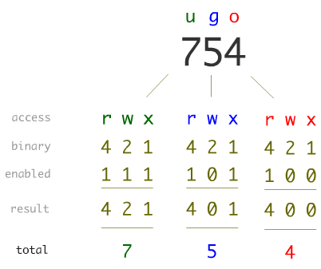

% Unix
% Silvestro Di Pietro
% 22/03/2023

# Definition

## Unix

{width=350}

is a family of multitasking, multiuser computer operating systems that derive from the original `AT&T Unix`, whose development started in `1969` at the Bell Labs research center by *Ken Thompson*, *Dennis Ritchie*, and others.

----

## Dennis Ritchie

{width=200}

> Dennis MacAlistair Ritchie (September 9, 1941 – c. October 12, 2011) 

----

##  unix

https://youtu.be/XvDZLjaCJuw

----

## grep

https://youtu.be/NTfOnGZUZDk


# Unix Commands

## Listing files

* `ls`    list files in current directory
* `ls` -l    list files in a long format
* `ls` -a    list all files (including hidden files) in current directory
* `ls` -F    adds indicators to the list output to identify directories and different types of files.

> For example `ls -al` would list all files in the current directory, including hidden files, in a long format.

----

## Special characters

* `.`    the current working directory
* `..`    the parent directory to working directory
* `~`   your home directory
* `/`   the root (top-level) directory. This is also the separator for directories
* `*`    a wildcard meaning any string of characters
* `?`    a wildcard meaning any single character

----

## Files

* `cp` file1 file2    makes a copy of file1 and calls it file2
* `mv` file1 file2    moves (renames) file1 to file2
* `rm` file1    removes (deletes) file1
* `rm` -i file1    asks for confirmation that you want to delete file1

> there are the `r` and `f` arguments where `r` is for recursive and `f` if for force 

----

## Directories

* `pwd`	print the working directory
* `cd` _dirname_	change directory to _dirname_
* `cd` _.._	change to the parent directory of the current
* `cd` _~_	change to your home directory
* `mkdir` _dirname_	makes a new directory with name "dirname"
* `rmdir` _dirname_	removes the directory with name "dirname". 
* `rmdir` -r _dirname_	recursively removes directories and subdirectories

----

## Text files

* `cat` _file1_    writes the whole of file "file1" to the terminal, also useful for concatenating files
* `more` _file1_    displays the file "file1" a page at a time
* `less` _file1_    a more versatile version of "more"
* `head` -30 _file1_    show the first 30 lines
* `tail` -25 _file1_    show the last 25 lines
* `tail` -f _file1_    show the last few lines and keep updating as the file grows
* `wc` _file1_    counts lines, words and characters in a file

----

## control keys

* `ctrl C`    interrupts whatever is currently running.
(It can get you out of trouble at embarrassing moments)
* `ctrl Z`    puts a foreground process into the background.
* `ctrl S`    suspends current terminal
* `ctrl Q   `   resumes current terminal

----

## Permissions

Unix allow to set ACL (access control list) to files.
User ROOT (Super User) can do anything so can assign permissions.
There are three sets:

* first byte of the set will give access to the OWNER of the file
* Second byte will give access to the GROUP beloging the file
* Third byte will give access privilege to anyone.
  
----

## Permission bytes

{width=600}

----

## List files
```bash
bash-3.2$ ls -la
total 72
drwxr-xr-x   7 sdipietr  staff    224 Mar 22 08:46 .
drwxr-xr-x  14 sdipietr  staff    448 Mar 21 14:38 ..
-rw-r--r--   1 sdipietr  staff   8196 Mar 21 14:42 .DS_Store
-rw-r--r--   1 sdipietr  staff  12387 Mar 21 16:50 05-Unix.html
-rw-r--r--   1 sdipietr  staff   3204 Mar 22 08:46 05-Unix.md
drwxr-xr-x   7 sdipietr  staff    224 Mar 21 14:53 images
-rw-r--r--   1 sdipietr  staff   1110 Mar 21 14:44 instituteStyle.html
```

----

## Permission alias

* `u`    user
* `g`    group
* `o`    others
* `a`    all (equivalent to ugo)
* `+`    gain
* `-`    lose
* `r`    read permission
* `w`    write permission
* `x`    execute permission

----

## chmod chown
chmod    changes file and directory permissions

* `chmod` u+r file1    change permissions of "file1" so user ("u") gains ("+") read permission ("r").
* `chmod` -R 754 _directory_

chgrg change group ownership

* `chgrp` group1 file1    change "file1" to belong to group "group1"

chown change ownership

* `chown` -R _root:user_ _directory_

