% Data structures
% Silvestro Di Pietro
% 14/04/2023

# Definition

## Data Structures

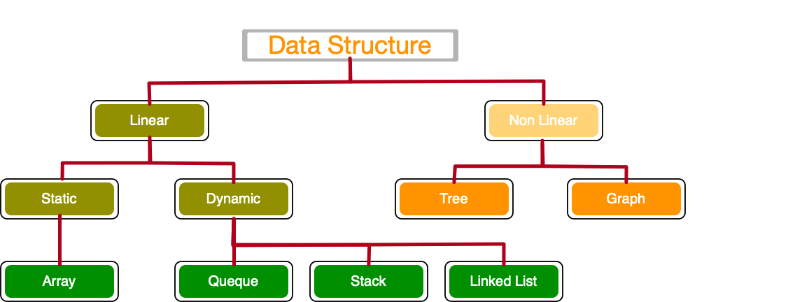{width=850}

A data structure is a storage that is used to store and organize data. It is a way of arranging data on a computer so that it can be accessed and updated efficiently.

## Array

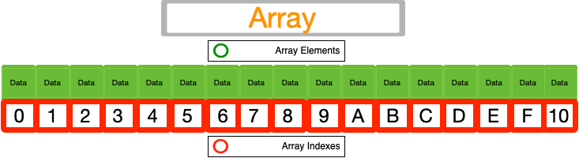{width=750}

An array is a collection of items stored at `contiguous memory locations`. The idea is to store multiple items of the same type together.

## Linked Lists

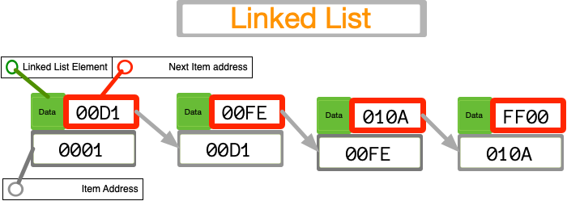{width=750}

A linked list is a linear data structure, in which the elements are `not stored at contiguous memory` locations.

## Stack

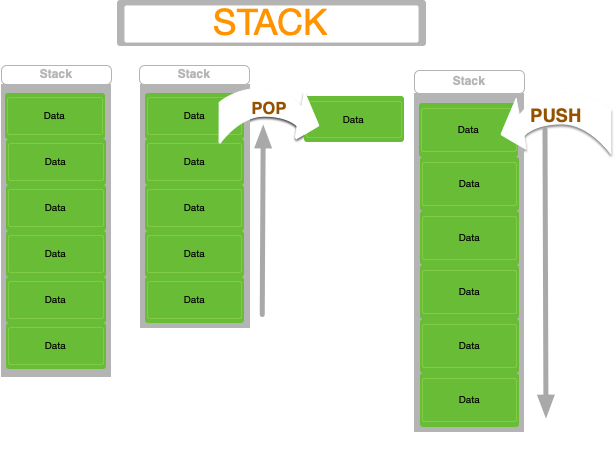{width=350}

Stack is a linear data structure that follows a particular order in which the operations are performed. The order may be LIFO(Last In First Out) or FILO(First In Last Out).

## Queue

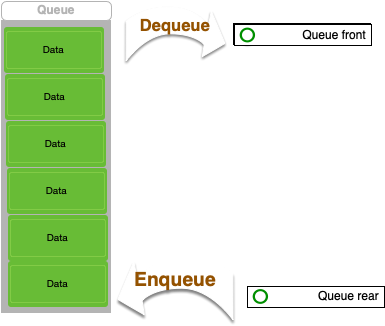{width=350}

A Queue is defined as a linear data structure that is open at both ends and the operations are performed in First In First Out (FIFO) order.

## Binary Tree

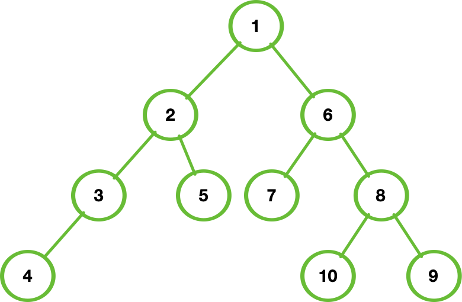{width=400}

Binary Tree is defined as a tree data structure where each node has at most 2 children. Since each element in a binary tree can have only 2 children, we typically name them the left and right child.

## Binary Search Tree

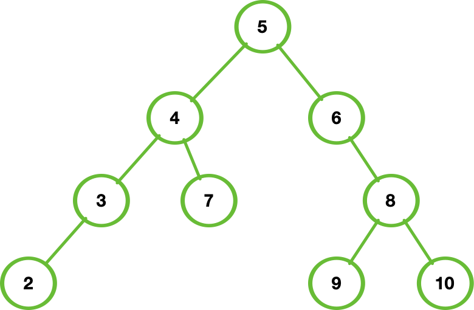{width=300}

* The `left subtree` of a node contains only nodes with keys lesser than the node’s key.
* The `right subtree` of a node contains only nodes with keys greater than the node’s key.
* The `left and right`	 subtree each must also be a binary search tree.

## Heap Min and Max

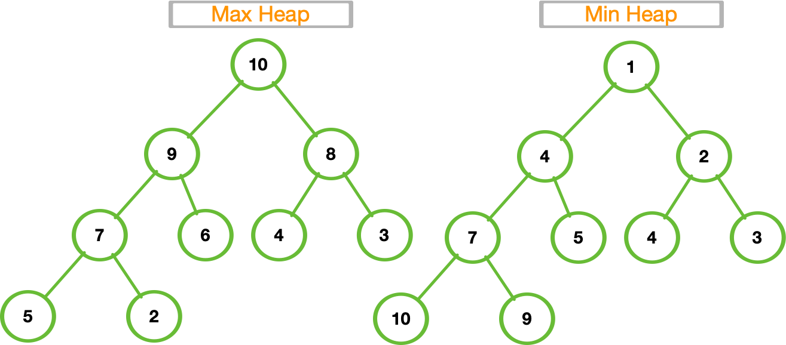{width=500}

A Heap is a special Tree-based Data Structure in which the tree is a complete binary tree.

## Hash Table

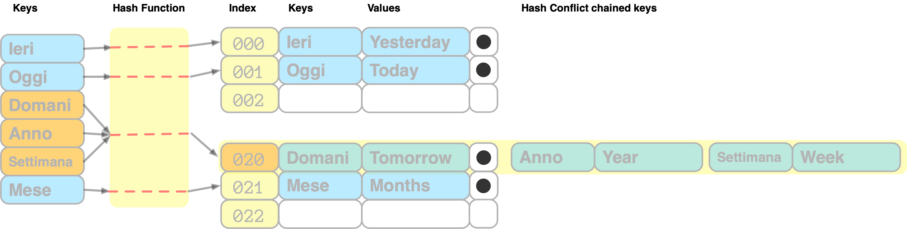{width=900}

Hashing is a technique or process of mapping keys, and values into the hash table by using a hash function. It is done for faster access to elements. 

## Graph

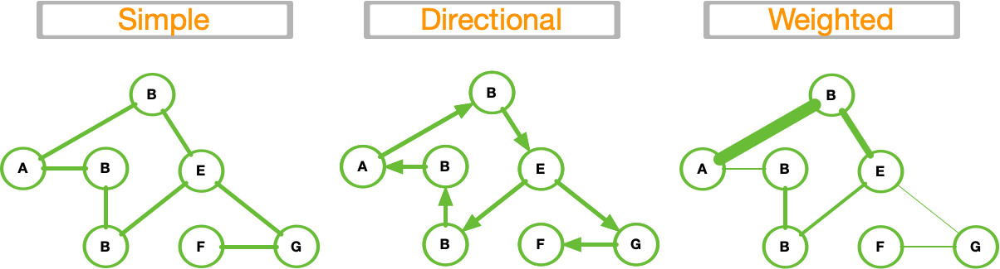{width=900}

A Graph is a non-linear data structure consisting of vertices and edges.

## Matrix

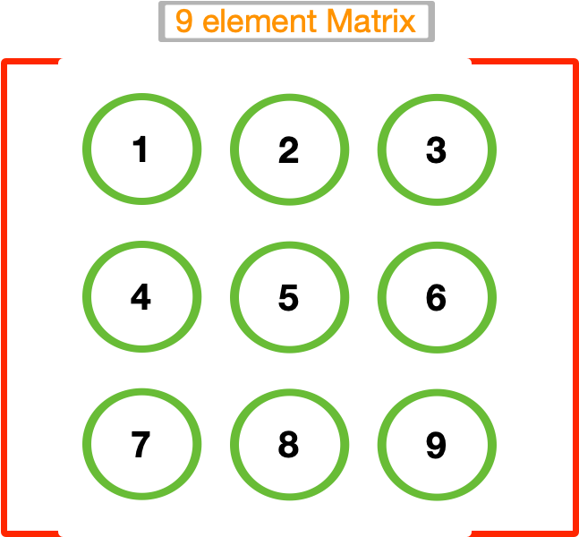{width=200}

A matrix represents a collection of numbers arranged in an order of rows and columns. It is necessary to enclose the elements of a matrix in parentheses or brackets.

# Binary Tree

## Tree Definitions

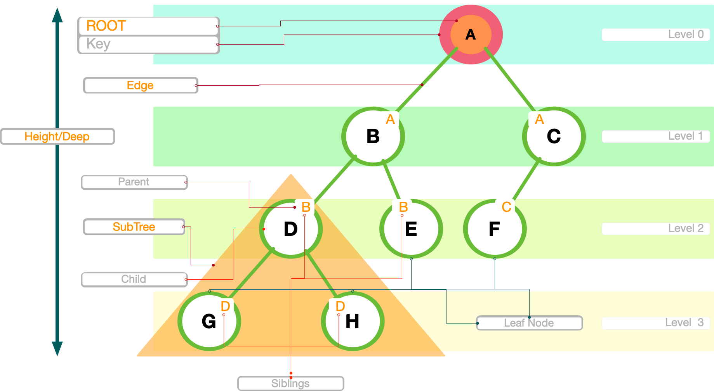{width=900}

## Some Usage

* Search Algoritms (**O**(logN)) `time complexity`
* Sorting algorithms (search Binary Tree and Heap Sort)
* Database systems (MPTT)
* File systems
* Compression algorithms (Huffman/zip)
* Decision trees (Machine learning)

## Tree Traversals
Traversing mean visit each node of the tree, there are three main method to do this with a Time Complexity of **O**(n)

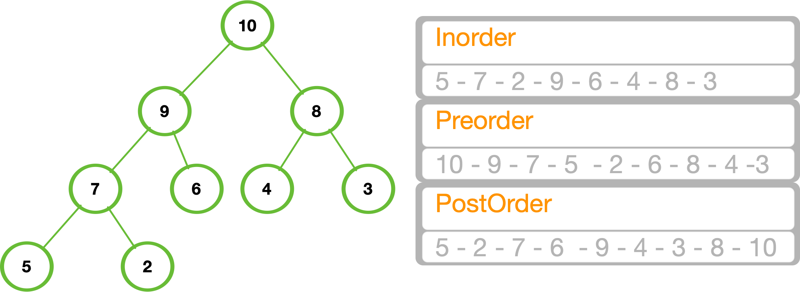{width=750}

## Inorder traversal

1. Traverse the left subtree recursively.
2. Visit the root node.  
3. Traverse the right subtree recursively.

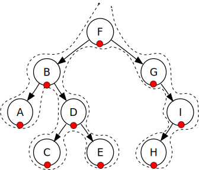{width=350}

## Preorder traversal

1. Visit the root.
2. Traverse the left subtree, recursively  preorder left-subtree
3. Traverse the right subtree, recursively preorder right-subtree.

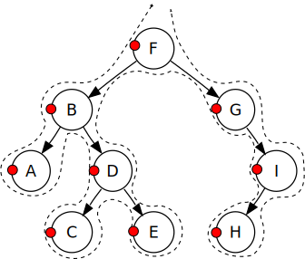{width=300}

## PostOrder traversal

1. Traverse the left subtree, recursively call postorder(left-subtree)
2. Traverse the right subtree, recursively call postorder(right-subtree)
3. Visit the root.

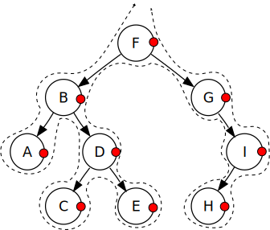{width=300}

## MPTT example

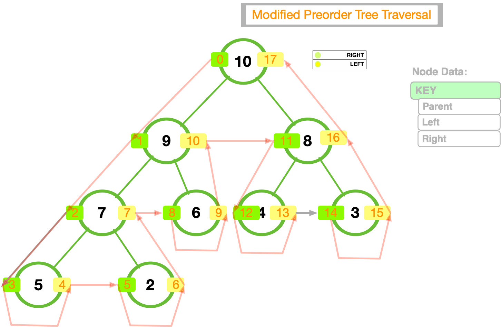{width=650}

## Binary search tree

. . .

{width=550}

## Insertion on tree 

. . . 

{width=550}

## Search on tree

. . . 

{width=550}

# Graphs

## Example	

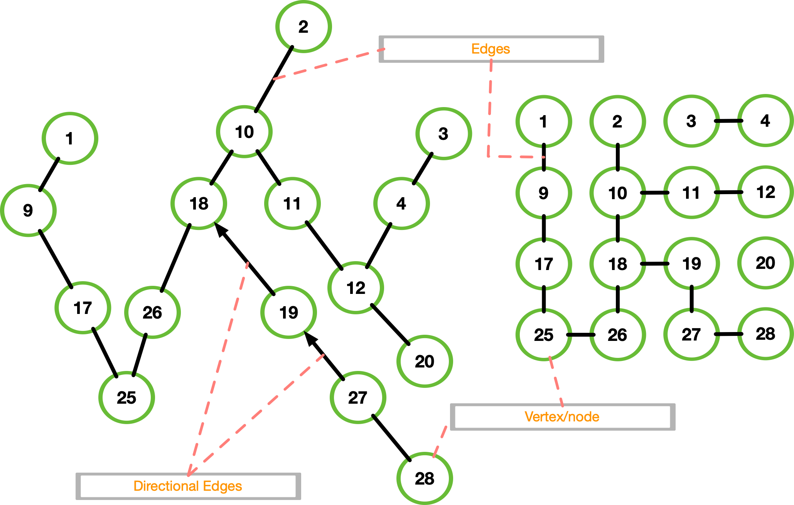{width=550}

## Traversing Breadth First search

Is an algorithm for traversing a tree data structure for a node. It starts at the tree root and explores all nodes at the present depth prior to moving on to the nodes at the next depth level. Extra memory, usually a `queue`, is needed to keep track of the child nodes that were encountered but not yet explored.

## BFS example

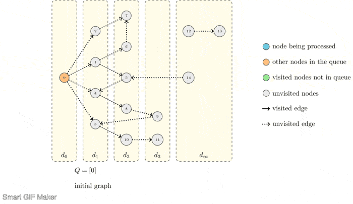{width=1000}

## Traversing Deep First Search

Depth-first search is an algorithm for traversing or searching tree or graph data structures. The algorithm starts at the root node (selecting some arbitrary node as the root node in the case of a graph) and explores as far as possible along each branch before backtracking.
Extra memory, usually a `stack`, is needed to keep track of the child nodes that were encountered but not yet explored.

## The Maze

Creation using `prism algorithm`, rapresentation as graph

{width=400}

## The Maze Dictionary

To run the algos we need to fill a dictionary with vertex and edges

{width=700}

## Maze BFS

{width=600}