% Network A
% Silvestro Di Pietro
% 27/04/2023

# Definition

##
We consider a network as a graph of connected entities created to allow exchange informations through nodes

## Unicast, Broadcast Multicast

Cast is the packet data stream.
1. `Unicast` will send data to an unique address, recipient
2. `Broadcast` send data to all recipients of a network
3. `Multicast` send data to a group of recipients

## Network Topology

Network Topology refers to the physical and logical arrangement of devices on a network. There are several different types of Network Topologies, including Bus, Star, Ring, Mesh, and Tree.

## Bus Topology

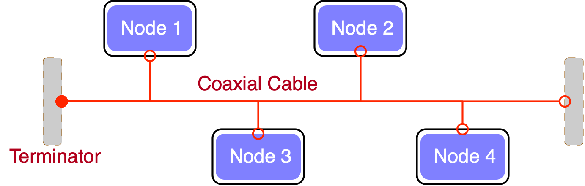{width=500}

This type of topology is easy to set up and manage, but it can be vulnerable to failure if the backbone cable or bus is damaged

## Star Topology

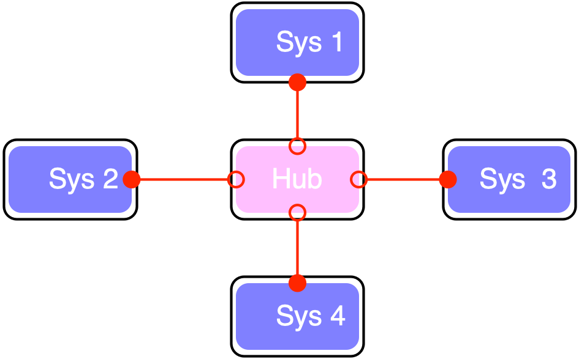{width=500}

This type of topology is more robust than the Bus topology, but it can be more expensive to set up and manage.

## Star Topology

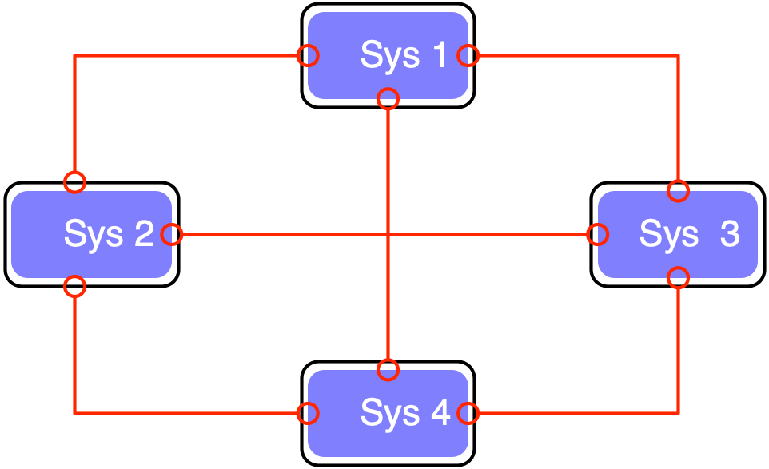{width=500}

This type of topology is highly reliable and robust, but it can be expensive to set up and manage.

## Tree Topology

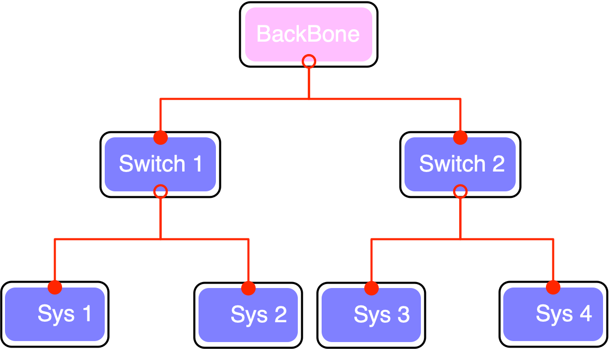{width=500}

This type of topology is easy to set up and manage, but it can be affected by a single device failure.

## Types of Networks

Main Types are 

1. `LAN` (local Area Network)
2. `MAN` (Metropolitan Area Network)
3. `WAN` (Wide Area Network)
 Other networks:
`PAN` (Personal Area Network), `SAN` (Storage Area Network),`EPN` (Enterprise Private Network), `VPN` (Virtual Private Network)

## PAN

a personal area network having an interconnection of personal technology devices to communicate over a short distance. It covers only less than 10 meters.
Usually is a `bluethoot` network

## LAN

Connects network devices in such a way that personal computers and workstations can share data, tools, and programs. The group of computers and devices are connected together by a switch, or stack of switches, using a private addressing scheme as defined by the TCP/IP protocol.

## MAN

Covers a larger area than that covered by a LAN and a smaller area as compared to WAN. MAN has a range of 5-50km. It connects two or more computers that are apart but reside in the same or different cities. It covers a large geographical area and may serve as an ISP (Internet Service Provider).(FastWeb)

## WAN

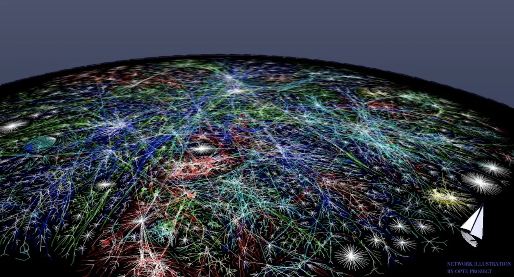{width=700}

The world internet connection via fiber line, satellites links

# The OSI model

## OSI Layers

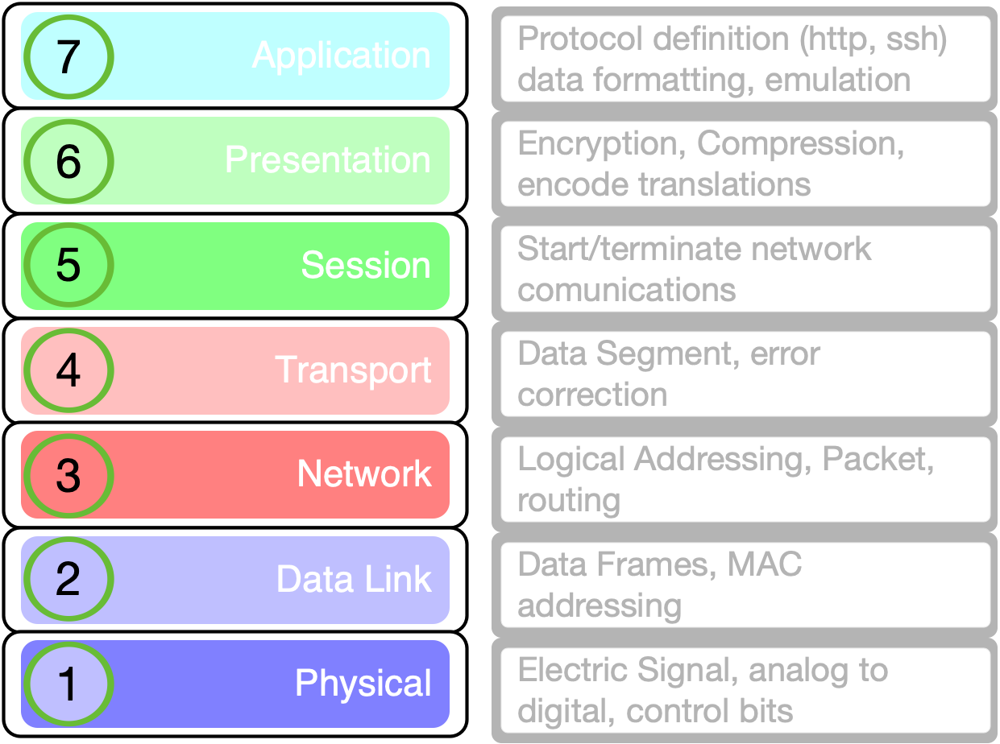{width=500}

Open System Interconnection model

## Layer 1

Physical Layer

* `Telephone network modems`.
* `IrDA` physical layer.
* `USB` physical layer.
* `EIA RS-232, EIA-422`....
* `Ethernet cables and plugs` 10BASE-T, 10BASE ...
* Varieties of `802.11 Wi-Fi` physical layers.
* `DSL`.
* `ISDN`.

----

## Layer 1 devices
	
	Modems 
	Hubs 
	
	
## Layer 2

Data Link Protocols

* `ARP`	Address Resolution Protocol
* `Ethernet`	
* `FDDI`	Fiber Distributed Data Interface
* `IEEE 802.2` MAC layers
* `IEEE 802.11` wireless LAN
* `I²C`	
* `PPP`	Point-to-Point Protocol
* `Spanning Tree Protoco`l	
* `Token ring`

## Layer 2 devices
	
	Switches 
	WAP (wireless access point) 

----

## Layer 3

Network Layer Protocols

* `ICMP`	Internet Control Message Protocol
* `IPsec`	Internet Protocol Security
* `IPv4/IPv6`	Internet Protocol
* `IPX`	Internetwork Packet Exchange
* `RSMLT`	Routing Information Protocol

----

## Layer 4

Transport Layer

* `ATP`	AppleTalk Transaction Protocol
* `IL`	Fibre Channel Protocol
* `TCP`	Transmission Control Protocol
* `UDP`	User Datagram Protocol

## Layer 5

Session Layer Protocol

* `ADSP`	AppleTalk Data Stream Protocol
* `H.245`	Call Control Protocol for Multimedia Communication
* `NetBIOS`	Network Basic Input Output System
* `PAP`	Password Authentication Protocol
* `PPTP`	Point-to-Point Tunneling Protocol
* `RPC`	Remote Procedure Call Protocol
* `SMPP`	Short Message Peer-to-Peer
* `SOCKS`	the SOCKS internet protocol

## Layer 6

Presentation Layer

> Is the lower layer for an application layer can usually manage

* Data conversion
* Character code translation
* Compression
* Encryption and Decryption

## Layer 7

Application Layer

* `Atom`(rss)	Publishing Protocol
* `HTTP`	HyperText Transfer Protocol
* `LDAP`	Lightweight Directory Access Protocol
* `NFS`	Network File System
* `RPC`	Remote Procedure Call
* `SMB`	Server Message Block
* `SMTP`	Simple Mail Transfer Protocol
* `SSH`	Secure Shell
* `Tor`	anonymity network

# TCP/IP Model

## DoD model

 designed and developed by the Department of Defense (DoD) in the 1960s and is based on standard protocols. It stands for Transmission Control Protocol/Internet Protocol.

## TCP/IP Layers

{width=500}

## Layer 3

Internet Layer

* `IP` Will deliver packets from the source to the destination using the IP addresses in the packet headers. IP has 2 versions: IPv4 and IPv6. 
* `ICMP` Internet Control Message Protocol. It is encapsulated within IP datagrams.Provide information about network.
* `ARP` Address Resolution Protocol. Its job is to find the hardware address of a host from a known IP address.

## Layer 4

Transport Layer

* `TCP` Character-by-character transmission rather than separate packets. A starting point that establishes the connection, the whole transmission in byte order, and an ending point that closes the connection.
* `UDP` Connections between receiving and sending hosts are not verified by UDP. Applications that transport little amounts of data use UDP

## Layer 5
Application Layer

* `HTTP` and `HTTPS` 
* `SSH`
* `FTP` and `sftp`
* `ldap` and `ldaps`
* etc

## differences I

| TCP/IP | OSI |
| ---- | ----- |
|TCP refers to Transmission Control Protocol. | OSI refers to Open Systems Interconnection. |
|TCP/IP has 5 layers. | OSI has 7 layers. |

## differences II

| TCP/IP | OSI |
| ---- | ----- |
|TCP/IP is more reliable | OSI is less reliable |
|TCP/IP does not have very strict boundaries. | OSI has strict boundaries |

## differences III

| TCP/IP | OSI |
| ---- | ----- |
|TCP/IP follows connection-less a horizontal approach. | OSI follows a vertical approach. |
|TCP/IP uses both session and presentation layer in the application layer itself. | OSI uses different session and presentation layers. |

## differences IV

| TCP/IP | OSI |
| ---- | ----- |
|TCP/IP developed protocols then model. | OSI developed model then protocol. |
|Transport layer in TCP/IP does not provide assurance delivery of packets. | In OSI model, transport layer provides assurance delivery of packets. |

## differences V

| TCP/IP | OSI |
| ---- | ----- |
|TCP/IP model network layer only provides connection less services. | Connection less and connection-oriented both services are provided by the network layer in the OSI model. |
|Protocols cannot be replaced easily in TCP/IP model. | Protocols are better covered and is easy to replace with the change in technology.

# IP addressing

## IP Addressing

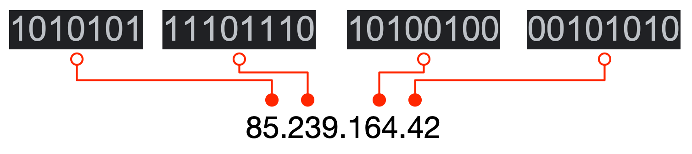{width=500}

IP address is an address having information about how to reach a specific host, especially outside the LAN. An IP address is a 32 bit unique address having an address space of 2^32.

## Classfull IP 

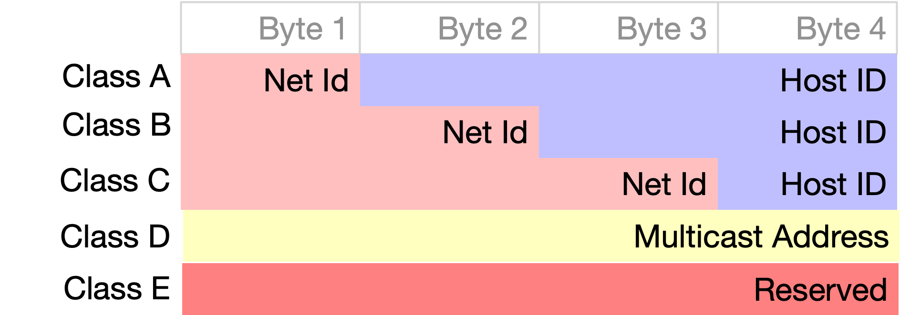{width=800}

## CLassfull IP II

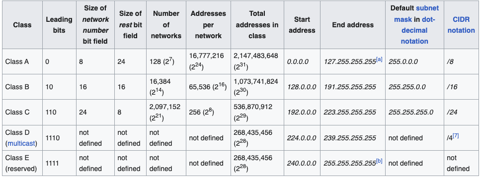{width=800}

## Classless Routing

Classless Inter-Domain Routing (CIDR) 
is a method for allocating IP addresses and for IP routing. The Internet Engineering Task Force introduced CIDR in 1993 to replace the previous classful network addressing architecture on the Internet

## CIDR notation

CIDR notation is a compact representation of an IP address and its associated network mask. The notation was invented by Phil Karn in the 1980 CIDR notation specifies an `IP address`, a slash (`'/'`) character, and a decimal number. 

> The decimal number is the count of consecutive leading 1-bits (from left to right) in the network mask. The number can also be thought of as the width (in bits) of the network prefix.

## Example

For example:

198.51.100.14/24 represents the IPv4 address 198.51.100.14 and its associated network prefix 198.51.100.0, or equivalently, its `subnet mask 255.255.255.0`, which has `24 leading 1-bits`.

## subnet Mask

A subnet mask is a `bitmask` that encodes the prefix length associated with an IPv4 address or network in quad-dotted notation: 32 bits, starting with a number of 1-bits equal to the prefix length, ending with 0-bits, and encoded in four-part dotted-decimal format: `255.255.255.0`.

## IANA

The Internet Assigned Numbers Authority (IANA) issues to regional Internet registries (RIRs) large, short-prefix CIDR blocks. However, a /8 (with over sixteen million addresses) is the largest block IANA will allocate

## CIDR Blocks

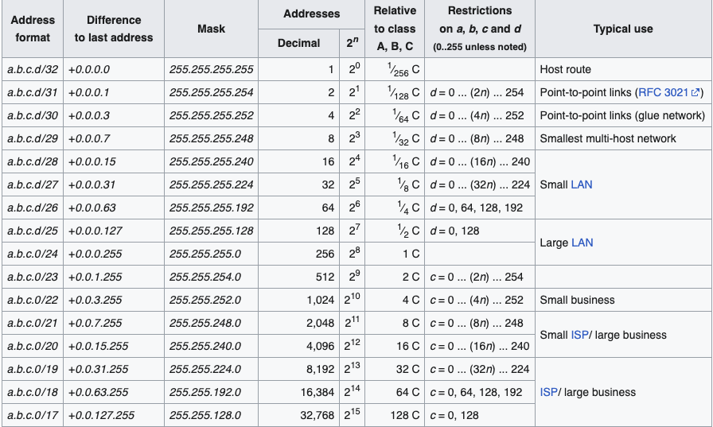{width=800}

## Private Network Blocks

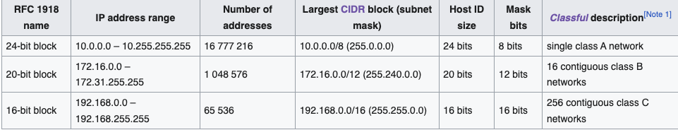{width=800}

# TCP/IP

## IP header

{width=500}

The ip header has an header checksum that will ensure that the packet header is correctly formed.
This will avoid for example "spoofing" pratices(different IP adress of the sender)

## Protocol Handshake

{width=800}

The ending of the handshake will result in a properly crafted connection on a server designed port.

# DNS

## DNS

The Domain Name System (DNS) is the phonebook of the Internet. Humans access information online through domain names, like ifom.eu or unimi.it. Web browsers interact through Internet Protocol (IP) addresses. DNS translates domain names to IP addresses so browsers can load Internet resources.

## Domain Tree

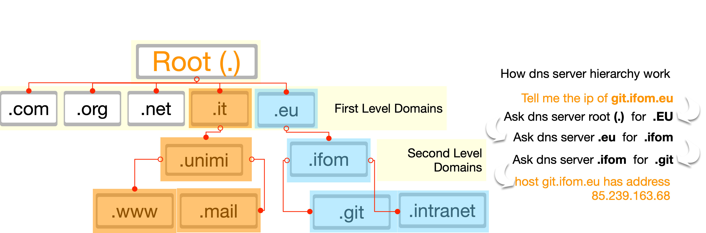{width=800}
