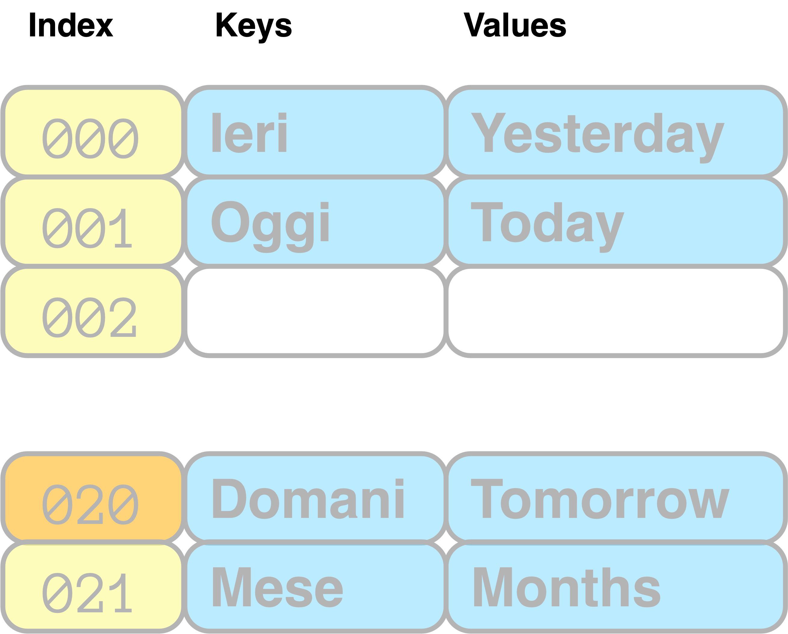
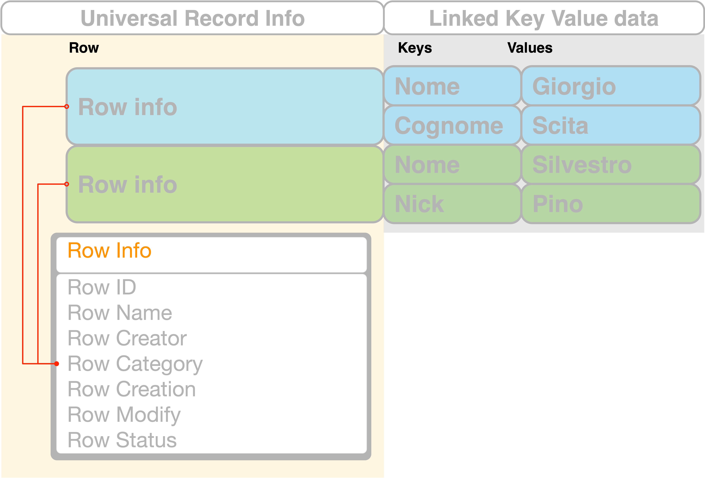
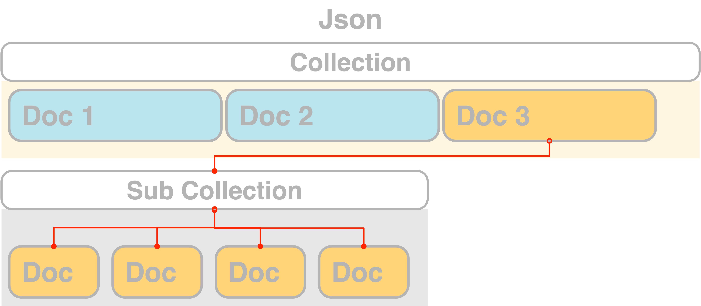
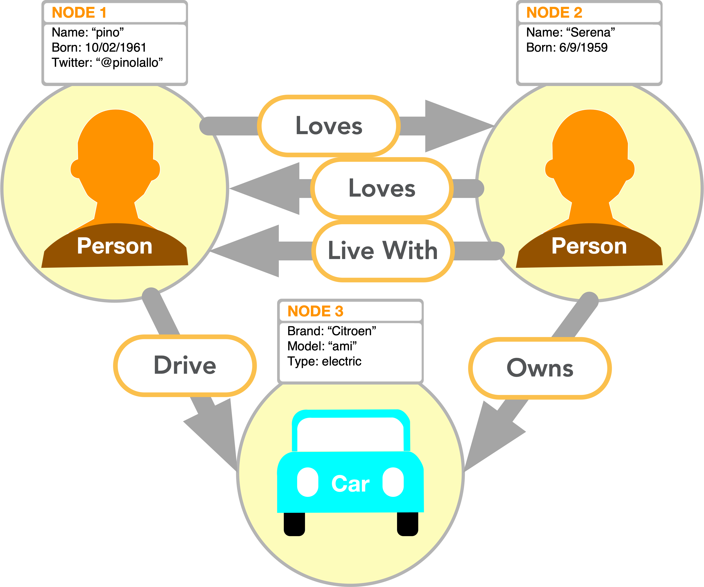
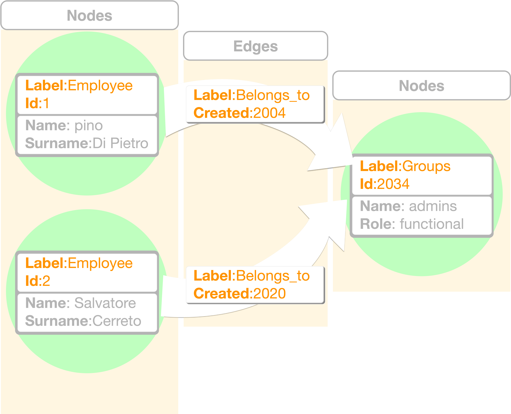
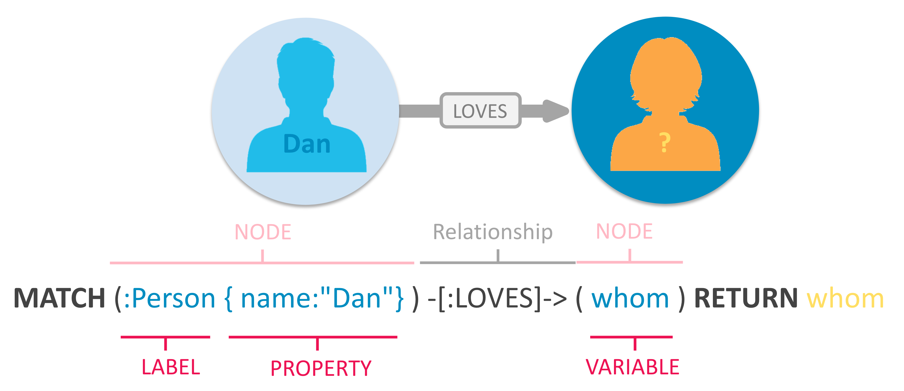
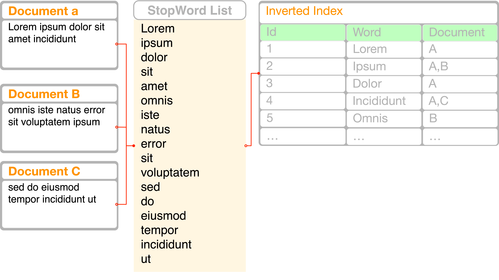

% Database
% Silvestro Di Pietro
% 8/05/2023

# Definition

## Database 

{width=500}

A set of data  that is accessible in various ways


## Data in Data structure

The simpler way to imagine a database is the simpler form of data structure: the `array`

1. We must imagine a database as a structured data.
2. This data can be structured also if his data are not (unstructured).
3. The data can be represented as `data structure` (tree, graph, hash tables ...).
4. A book is a database, with an index, is a searchable book


# Database paradigm

## Databases type
There are seven different database paradigm, so 7 way to organize informations into a computer.

* `key-value`
* `Wide Column`
* `Document oriented`
* `Relational`
* `Graph`
* *Search*
* *Multi Model*


## Different usage


{width=700}


## Database priorities
We can have different category of priorities:

-  Data size (number of records)
-  Write Many
-  Read Many
-  Number of computational element in data unit
-  Speed 
-  Complex searches


## The nature of data

> The nature of your data will be the key for choosing the right database Paradigma

# key value

## Structure
The key value database is mainly a python dictionary 

{width=500}


## Usage

- In memory data (ram)
- Low number of computational element
- Speed
- low complex searches

Cache, Messaging, 


## Redis

The open source, in-memory data store used by millions of developers as a database, cache, streaming engine, and message broker.

> https://redis.io/

{width=300}

# wide Column

## Structure
The wide Columns DB is and indexed collection of key-value records

{width=600}


## Usage

- big Data size
- write many
- Low number of computational element
- low complex searches
- speed
- different column per record

handle large amounts of data and a high number of concurrent users. It is often used in applications that require high write throughput and low latency, such as online gaming, real-time analytics, and e-commerce.

## RAP Tool

Rap Tool use the DDBlib that I wrote in 2006 in order to answer the logging procedure, the registration procedure.
The class library implement the: `GPD` approach

- GET
- PUT will create if item not found.
- DELETE 


## Cassandra

> https://cassandra.apache.org/_/index.html

{width=300}


# Document Oriented

## Structure
A `key-value` tree organised structure of `json` (or `bson` binary `json`) documents. Some still Use of `XML` for the document.

{width=700}

## Usage

- big Data size
- write many
- Low number of computational element
- low complex searches
- speed
- different data per record

The particularity of those dbs is managing semi-structured data and developer friendly approach

## CRUD

This is the one of feature of this 3 databases paradigm. The reason is their `noSql` approach, and the usage of
`CRUD` managing of the record

- `C`reate
- `R`etrive
- `U`pdate
- `D`elete

Other main feature is the missing declaration of the database structure.

## MongoDB

> https://www.mongodb.com/

{width=700}

# Relational Model

## Ted Codd

{width=150}

The relational model come from `Edgar F "Ted". Codd` 
The purpose of the relational model is to provide a declarative method for specifying data and queries: users directly state what information the database contains and what information they want from it


## Structure

{width=750}


## Usage
- big Data size
- write many/read many
- large number of computational element
- complex searches

You need to structure the data, describe relation, assign type to fields, declare index and
search keys: is powerful but not an easy task to project and maintain

## SQL
Structured Query Language, 

```sql
SELECT user.name as member, groups.name as group
 FROM  user
 left JOIN  groups
   ON  groups.group_id = user.user_id
```


## Maria DB

> https://mariadb.com/

{width=750}


# Graph

## Structure a
{width=650}


## Structure b
{width=400}

A graph database (`GDB`) uses graph structures for semantic queries with `nodes`, `edges`, and `properties` to represent and store data.


## Usage
- big Data size
- write many/read many
- low number of computational element
- very complex searches
- speed

Is the database of choice when the relations among data are the most significative thing.

## cypher
Cypher Query Language

{width=750}


## neo4j

>https://neo4j.com/

{width=450}


# Full-text search

## Structure
{width=600}

The full text search is an `indexer` that will catalogs words `parsed` from a list of document allowing a blaze fast search. (like index in books)

## Usage
- big Data size
- read many
- very low number of computational element
- speed


Search engines, log browsers, data lake searches, filesystem browsers
 
## elasticSearch

>https://https://www.elastic.co/

{width=450}

