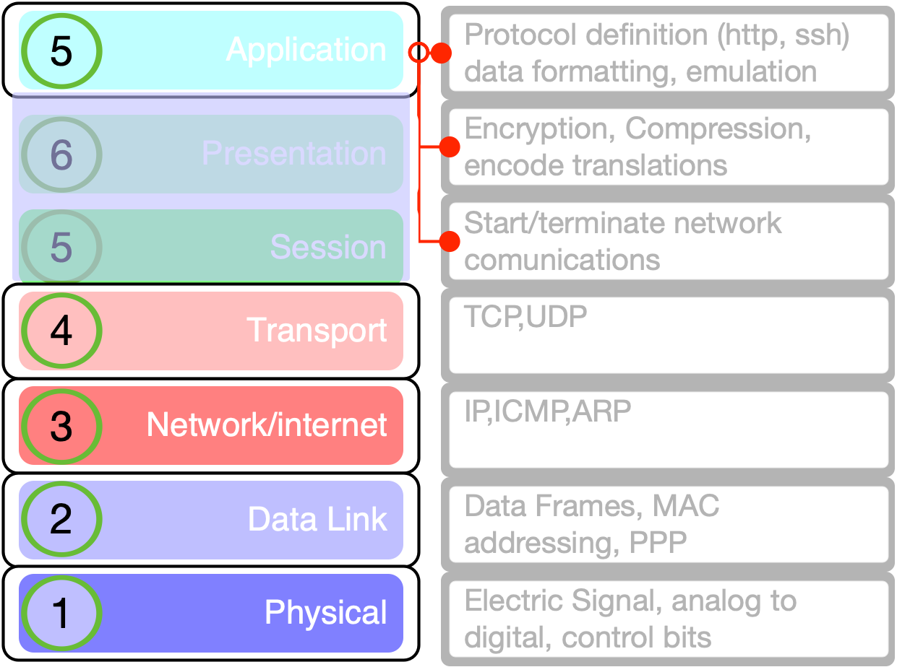
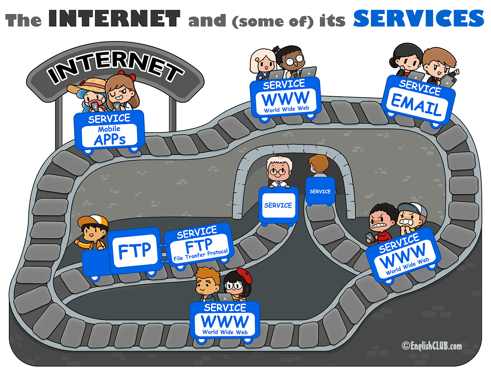
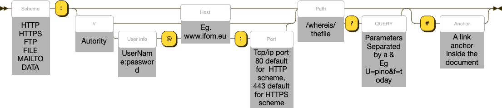
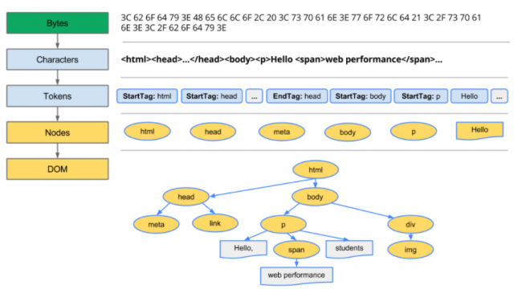
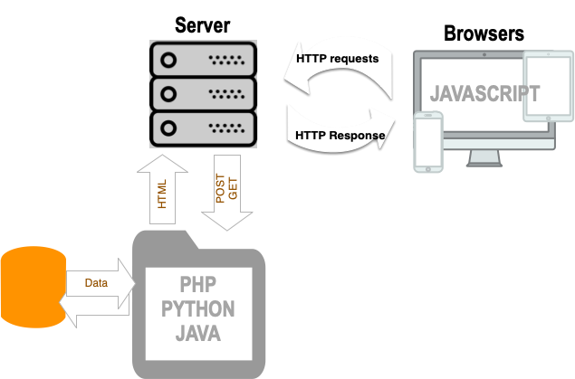
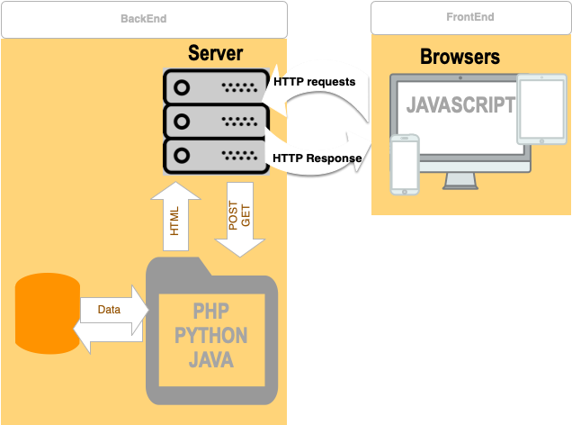

% Web Development
% Silvestro Di Pietro
% 6/10/2023

# Web

## TCP/IP layer 5 protocol 

{width=500}

  <em>https://github.com/pinolallo/BFG_2023_Slides/blob/main/08-network/08-network_a.md#tcpip-layers</em>

## network is a railroad

{width=500}

## Web
Common Services

* `http` and `https` (the web pages)
* `email` (the email system)
* `ftp` (the File Transfer Protocol)
* ...

# http 

## W3 ( WWW )
The WorldWideWeb (W3) is a wide-area hypermedia information retrieval initiative aiming to give universal access to a large universe of documents.

here the link of the first web site
`https://info.cern.ch/hypertext/WWW/TheProject.html`

## Web server

{width=700}
The web server in it's simple form is just a file server that will transmits over the tpc/ip network a file requested by a browser using an `url`

## URL 
URL is for `Uniform Resource Locator` is a part of the URI `Uniform Resource Identifier`

URIs may be used to identify anything, including real-world objects, such as people and places, concepts, or information resources such as web pages and books. 

## URI structure

> schematics of an uri

{width=1000}
{width=7000}
{width=7000}

## File types served by a web server
Using an uri you can request a file such as:

-  `html`
- `images`
    - jpeg gif png webP svg ..
- `xml`
- `json`

# html

## markup language
>HTML is the standard markup language for Web pages tha will be rendered by a rendering engine

        <!DOCTYPE html>
        <html>
            <head>
                <title>Page Title</title>
            </head>
            <body>
                <h1>This is a Heading</h1>
                
This is a paragraph.

            </body>
       </html>

## rendering
Rendering is a process that turns website code into pages users can see/use. The process is  made by a rendering engine inside a web browser

{width=600}

## html file parts
- html (the html file)
- head (the infos about the html file)
- body the displayed part of the html file

## html Basics
- the tag
    - \<tag\>things inside a tag\</tag\> (the \</\> close the tag)
- self closed tag
    - \<tag /\> (nothing inside)
    
Please check this page for many examples
        *<em>https://www.w3schools.com/html/html_examples.asp</em>

# XML

## XML
`Extensible Markup Language` (XML) is a markup language and file format for storing, transmitting, and reconstructing arbitrary data.
https://en.wikipedia.org/wiki/XML
`Xml` use the same markup structure of `HTML` using tags:
You can define you element ad fill with info

## XML DOM

A browser will transform the `HTML` into a tree structure inside an xml 
{width=700}

# Web apps

## Structure
Web is not just static pages, can be dynamically coded

{width=500}

## REQUESTS
the requests to a server from browser:

- `POST`
- `GET`
- PUT
- `HEAD`
- DELETE
- PATCH
- OPTIONS
- CONNECT
- TRACE

## The POST Method

POST is used to send data to a server to create/update a resource.
Some notes on POST requests:

- POST requests are never cached
- POST requests do not remain in the browser history
- POST requests cannot be bookmarked
- POST requests have no restrictions on data length

## The GET Method

GET is used to request data from a specified resource.
<pre>/test/demo_form.php?name1=value1&name2=value2</pre>

- GET requests can be cached
- GET requests remain in the browser history
- GET requests can be bookmarked
- GET requests should never be used with sensitive data
- GET requests have length restrictions
- GET requests are only used to request data (not modify)

## The HEAD Method

HEAD is almost identical to GET, but without the response body.
In other words, if GET /users returns a list of users, then HEAD /users will make the same request but will not return the list of users.
HEAD requests are useful for checking what a GET request will return before actually making a GET request - like before downloading a large file or response body.

## Back and front

{width=700}

# FrontEnd

## BASICS
Front end (User Interface) is managed by `HTML` `CSS` `JAVASCRIPT` 

THE head of html wiLL include also the `CSS` files and the `Javascript` files

## CSS
- CSS stands for Cascading Style Sheets
- CSS describes how HTML elements are to be displayed on screen, paper, or in other media
- CSS saves a lot of work. It can control the layout of multiple web pages all at once
- External stylesheets are stored in CSS files

<em>https://www.w3schools.com/css/</em>

## JAVASCRIPT
- JavaScript is the world's most popular programming language.
- JavaScript is the programming language of the Web.
- JavaScript is easy to learn.

<em>https://www.w3schools.com/js/default.asp</em>

# BackEnd
## WEB
- DATABASE interface
- request query management
- security
- html response

## API
- DATABASE interface
- request query management
- security
- json / xml  response

